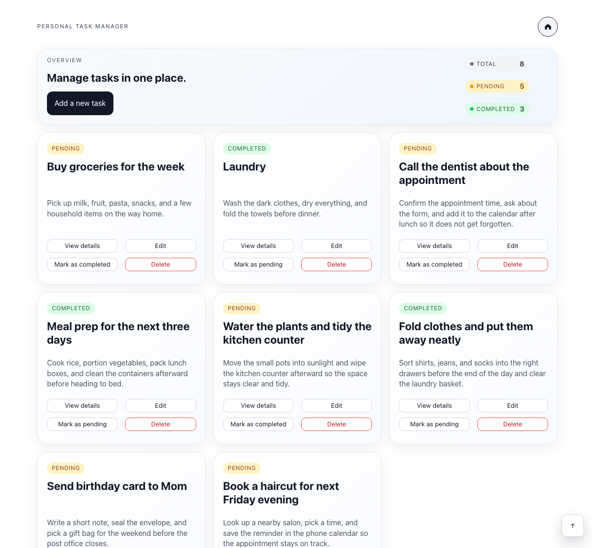
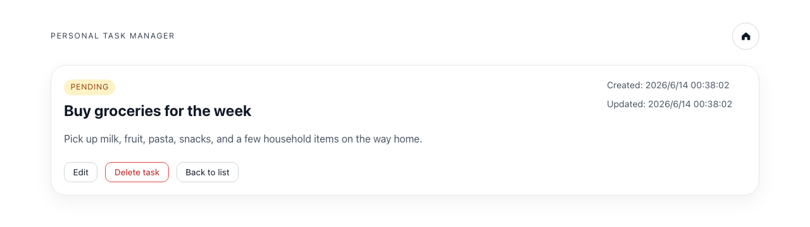
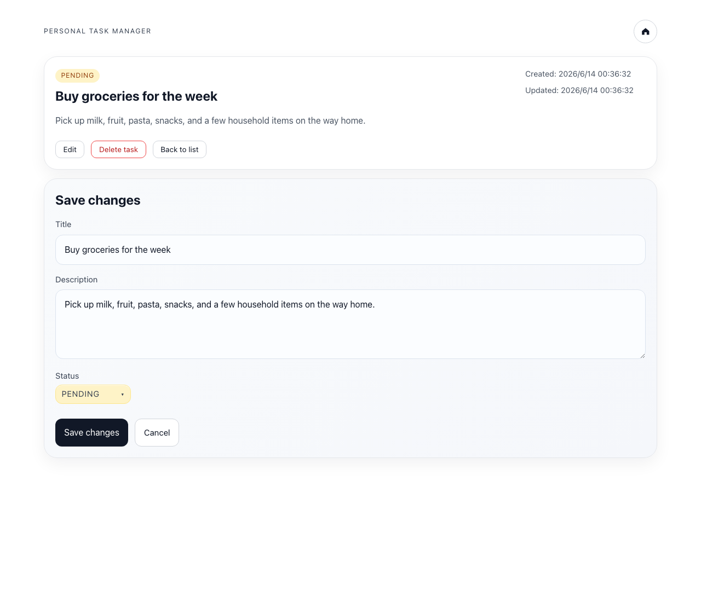
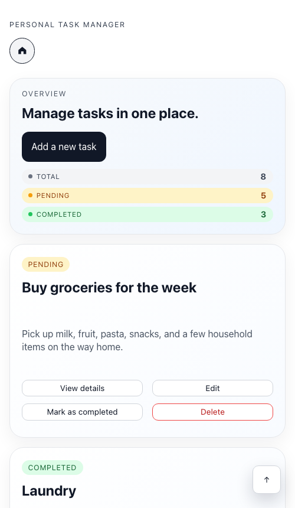

# Personal Task Manager

A clean, fast single‑page app for keeping personal tasks in one place — capture
what you need to do, track progress at a glance, and edit or tidy up as you go.
Built with React, TypeScript, and React Router.



---

## Features

**Manage your tasks**
- Create tasks with a title, description, and status
- Edit a task's title, description, and status at any time
- Delete tasks you no longer need
- Flip a task between *Pending* and *Completed* with a single click from its card

**See where things stand**
- An overview panel summarizes your list live — Total, Pending, and Completed —
  with color‑coded badges so progress is obvious at a glance

**A considered editing experience**
- A reusable form powers both adding and editing
- Inline validation keeps titles and descriptions from going blank
- A custom status picker (built as an accessible listbox) with keyboard support
  and click‑outside dismissal
- Adding a task asks for a quick confirmation so nothing slips in by accident

**Details that make it feel finished**
- Per‑task details page with created / updated timestamps
- Friendly empty and "task not found" states
- Back‑to‑top control, tidy card layout, and clear focus styles
- Your tasks are saved to the browser, so they're still there when you return

**Works everywhere**
- Responsive layout for desktop, tablet, and mobile
- Keyboard‑navigable with ARIA roles and labels throughout
- Runs in any modern browser (Chrome / Edge / Firefox / Safari)

---

## Screenshots

**Task details**



**Editing a task**



**On mobile**



---

## Tech Stack

- **React 18.3**
- **TypeScript** (`strict` mode)
- **React Router v6**
- **Vite** for the dev server and build

---

## Getting Started

```bash
# install dependencies
npm install

# start the dev server (http://localhost:5173)
npm run dev
```
